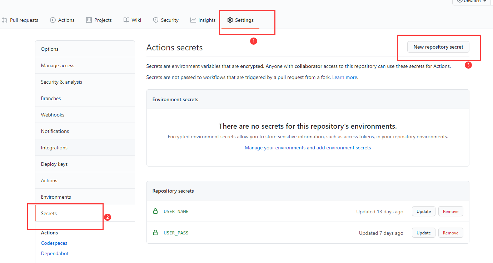
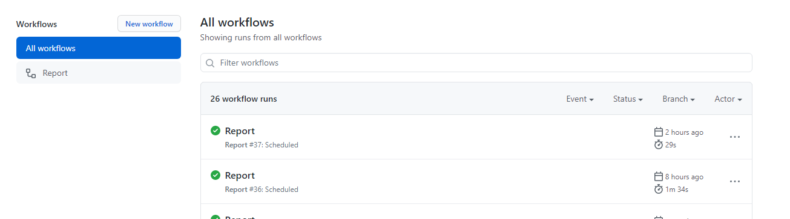

# 🎃易知独秀-体温上报脚本

> 使用者有责任和义务保证自己上传的打卡数据真实可靠。  
> 本项目仅供学习交流使用，严禁用于其他用途! For learning and communication only, other use is strictly prohibited！  
> 作者不承担任何法律责任！The author assumes no legal liability！  

体温自动上报，定时在线执行

## ✨使用方法

> 本项目使用Github Action作为你的服务器在线定时执行,安全且方便。

1. **fork该仓库到你的项目**
   下面都是设置你的项目
2. **添加secret // **Important!****
   进入: Settings-> Secrets-> new repository secret
   添加USER_NAME与USER_PASS两个key, 对应value为易班的用户名与密码
   
3. **激活Actions**
   进入: Actions 点击 Understand
   点击右侧enable workflow // **Important!**
   

**OK !**

**其他说明**

> * 一定要激活actions，否则不会触发定时
> * Github Actions的配置文件(.github/workflows/deploy.yml)中配置了时间
>   默认是每天北京时间07:00 12:00 可以自行修改
> * Github Action服务器时间为UTC格式,比北京晚8个小时;
>   除此之外，它要慢几分钟(5分钟左右), 自己测试时多等待5分钟左右
> * 运行日志去 Action下面查看

## 👀效果图

## 💝感谢

[Universoar](https://github.com/Universoar/gxnu-yzdx-autoreport)  
[Naihai](https://github.com/naihaishy/TsinghuaDailyReport)

